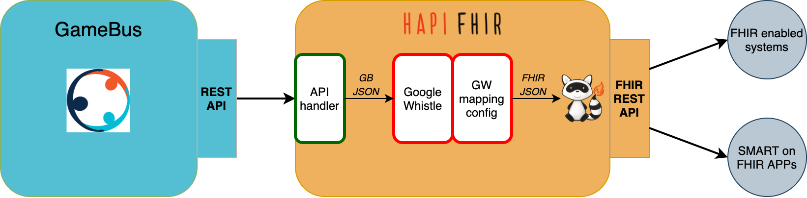

# GameBus-FHIR Layer

[](https://github.com/nwo-strap/gamebus-fhir-layer)
[](https://hub.docker.com/repository/docker/nlesc/gamebus-fhir-layer)


This is a framework to enable [GameBus](https://blog.gamebus.eu/) to provide [FHIR](http://hl7.org/fhir/) service.

The framework is built on [HAPI FHIR plain server](https://hapifhir.io/hapi-fhir/docs/server_plain/introduction.html) and [Google Whistle mapping engine](https://github.com/GoogleCloudPlatform/healthcare-data-harmonization)(GW) with the following architecture.




## Requirements

This framework is a wrapper on GameBus platform. To run and try it, first you need to
- get an account on GameBus, sign-up [here](https://app3.gamebus.eu/auth/signup)
- add some test data of activities through GameBus app, e.g. walk, run, bike

For more info, see GameBus [tutorial](https://devdocs.gamebus.eu/get-started/).

Mac with Apple silicon is not supported at the moment.

## Start the server
The most convenient way to start a GameBus-FHIR server is to run it in container with [docker](https://www.docker.com/),

```bash
docker run -it -p 8080:8080 nlesc/gamebus-fhir-layer start_fhir_server GAMEBUS_API_URL
# You need to replace `GAMEBUS_API_URL` with https://api3.gamebus.eu/v2
# to get the latest API url, check https://devdocs.gamebus.eu/assets/GameBus.test.postman_environment.json
```

when the server starts, it'll be served on http://localhost:8080. Check the next section [Usage](#Usage) to see how to send requests to FHIR server.

### Use your own mapping configs
You could use docker volume to mount your own [mapping_configs](https://github.com/nwo-strap/mapping_configs) to container, and it will override the existing mapping configs in the image. This will allow you to update mapping configs even when the container is running. Start a server with volume:

```
docker run -it -v YOUR_VOLUME:/mapping_configs -p 8080:8080 nlesc/gamebus-fhir-layer start_fhir_server GAMEBUS_API_URL
```

## Usage & test
To use FHIR APIs, we recommend using an API client, e.g. [Postman](https://www.postman.com/), [Hoppscotch](https://hoppscotch.io/), or [httpie](https://httpie.io/).

Postman collections for testing GameBus-FHIR APIs is in the repo [postman-collections](https://github.com/nwo-strap/postman-collections).


:bell: Request header `Authorization` is required and you must provide GameBus Bearer token to it when sending requests. See [GameBus guide](https://devdocs.gamebus.eu/get-started/) about how to obtain its token.

-   Test that your server is running by fetching its FHIR `CapabilityStatement`:

    -   <http://localhost:8080/metadata>

    This `CapabilityStatement` lists the available FHIR resources and operations.

-   Try reading back a FHIR resource from your server, e.g.

    -   <http://localhost:8080/Patient/001>
    -   <http://localhost:8080/Observation/001>
    -   <http://localhost:8080/Location/001>

    Note that you need to replace the ID `001` with a valid value (GameBus player ID or activity ID).

-   Try searching FHIR Observations, e.g.

    -   <http://localhost:8080/Observation?code=run,walk>
    -   <http://localhost:8080/Observation?date=gt2022-01-01>
    -   <http://localhost:8080/Observation?code=run,walk&date=gt2022-01-01>

    You could find available search parameters in the `CapabilityStatement`.


## Guide on building docker image

### Requirements
- [docker](https://docs.docker.com/engine/install/) (≥20.10.14)
    - Check [buildx](https://docs.docker.com/buildx/working-with-buildx/)(≥0.8) with `docker buildx`

### Build image

#### Use remote code from github repos

```
docker buildx build --no-cache=true -t gamebus-fhir-layer .
```
The building will automatically clone the three repos below to the container
- GW mapping engine https://github.com/nwo-strap/healthcare-data-harmonization
- Mapping cnofigs https://github.com/nwo-strap/mapping_configs
- GameBus-FHIR layer https://github.com/nwo-strap/gamebus-fhir-layer

By default, the code from the latest commit of `main` or `master` branch of each repo will be used. To use code of other version, you could provide branch name, commit or tag name to following docker arguments:
```
docker buildx build --no-cache=true -t gamebus-fhir-server \
    --build-arg GW_VERSION=gitBranch_orCommit_orTag \
    --build-arg GW_CONFIG_VERSION=gitBranch_orCommit_orTag \
    --build-arg GAMEBUS_FHIR_VERSION=gitBranch_orCommit_orTag \
    .
```
#### Use your local code
```
# it assumes you have cloned the three repos to the same place,
# and you run the command below in the clone of "gamebus-fhir-layer" repo

docker buildx build --no-cache=true -t gamebus-fhir-layer \
    --build-context gw-src=../healthcare-data-harmonization \
    --build-context gw-config-src=../mapping_configs \
    --build-context gamebus-fhir-src=. \
    .
```
In this way it allows you to update code locally and build image from it.


## Guide on development

### Setup development environment

- [Java JDK](https://openjdk.java.net/) (≥17)
- [Apache Maven](https://maven.apache.org/) (≥3.8)
- Google Whistle shared object (see [Guide on building Google Whistle shared object](#Guide-on-building-Google-Whistle-shared-object))
- [Mapping configs](https://github.com/nwo-strap/mapping_configs)
    - You need to [update the `local_path` in `mapping_configs/gamebus_fhir_r4/configurations/*.textproto` files](https://github.com/nwo-strap/mapping_configs#41-update-the-local_path-in-gamebus_fhir_r4configurationstextproto-files)


### Start local Java server

To start a local Java server, run the following command:

```bash
# NB: You have to replace "GAMEBUS_API_URL" and "mapping_configs_ABSOLUTE_PATH" with real values

mvn -D="jna.library.path=/usr/local/lib" \
    -Dgb.url="GAMEBUS_API_URL" \
    -Dgwc.player="mapping_configs_ABSOLUTE_PATH/gamebus_fhir_r4/configurations/player.textproto" \
    -Dgwc.activity="mapping_configs_ABSOLUTE_PATH/gamebus_fhir_r4/configurations/activity.textproto" \
    jetty:run
```

## Guide on building Google Whistle shared object

GameBus-FHIR layer use the shared object of Google Whistle mapping engine to conduct data mapping from GameBus structure to FHIR structure.

This guide shows you how to build the shared object from source code:

:bell: Make sure you have installed [the dependencies of GW engine](https://github.com/nwo-strap/healthcare-data-harmonization#details) before the following steps:

```bash
# Download Google Whistle repo
git clone https://github.com/nwo-strap/healthcare-data-harmonization
cd healthcare-data-harmonization/mapping_engine

# The export functions are in `mapping_engine/main/exports.go`,
# update this file based on your needs

# Build shared lib
# The script will generate `libgoogle_whistle.so`(for Linux) or `libgoogle_whistle.dylib`(for MacOS)
# and create corresponding symbolic link in `/usr/local/lib`, which will be used by GameBus-FHIR layer
./build_exports.sh
```


## Issues and Contributing

If you have questions or find a bug, please report the issue in the
[Github issue channel](https://github.com/nwo-strap/gamebus-fhir-layer/issues).
