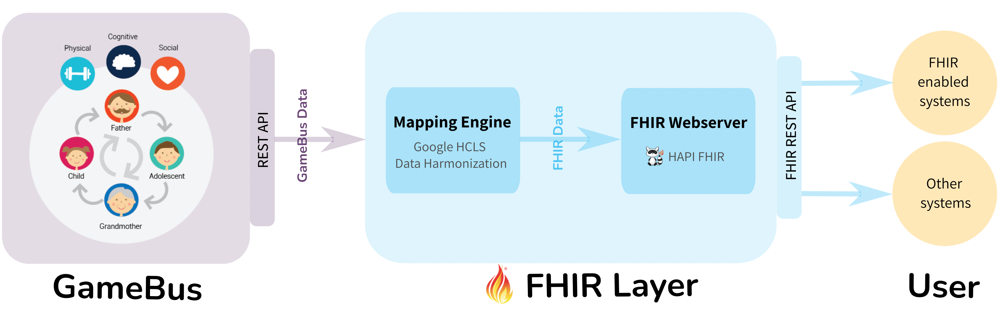

FHIR for GameBus
================

`GameBus`_ is a digital platform for people playing together healthy social,
cognitive, and physical activities in a personalized gaming experience.
Like many other healthcare platforms, GameBus has its in-house schema to
represent data and offers specific REST API to share these data.
This way, however, causes serious barriers to exchange data between platforms
that are not using the same schema or API. It’s like the communication challenge
between two people who don’t know each other’s language.

An ideal solution to this challenge is to enable different platforms to speak the
same language. Here, the “language” for exchanging healthcare info is FHIR.

`FHIR`_ (Fast Healthcare Interoperability Resources) is a standard for exchanging
healthcare information electronically. It describes healthcare data formats and
elements and API. FHIR has been more and more widely used in industry and
academia, becoming the de-facto standard.

To enable FHIR service for GameBus, we developed a FHIR layer for it.
Applying this FHIR layer to GameBus does not need any change or configuration
in GameBus platform. The diagram below shows the relationship between GameBus,
FHIR layer, and end users.

**Highlights:**

- Open source
- Smooth deployment as microservice
- Adding/changing mappings with ease
- Adding/changing operations for FHIR REST API with ease
- Not only for GameBus, easy to adapt for other healthcare platforms

Tutorials
---------

.. toctree::
   :maxdepth: 3

   tutorial

Guide for Development
---------------------

.. toctree::
   :maxdepth: 4

   dev

.. _GameBus: https://blog.gamebus.eu/
.. _FHIR: http://hl7.org/fhir/
