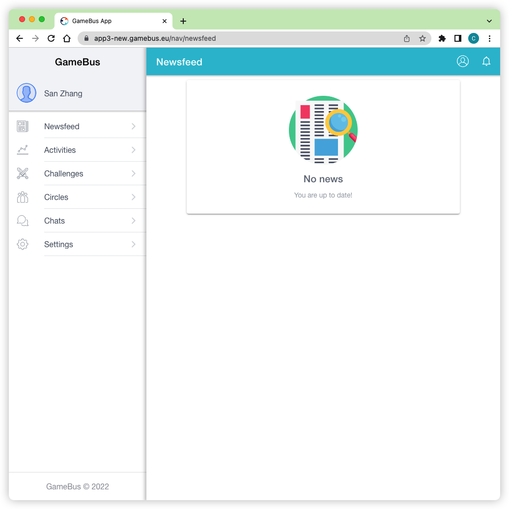
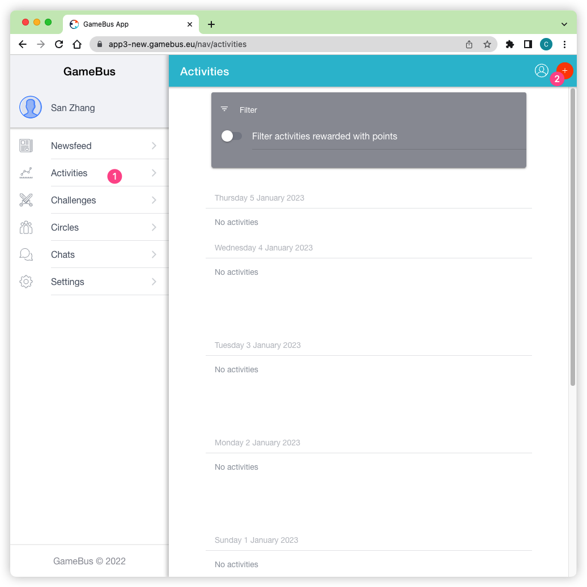
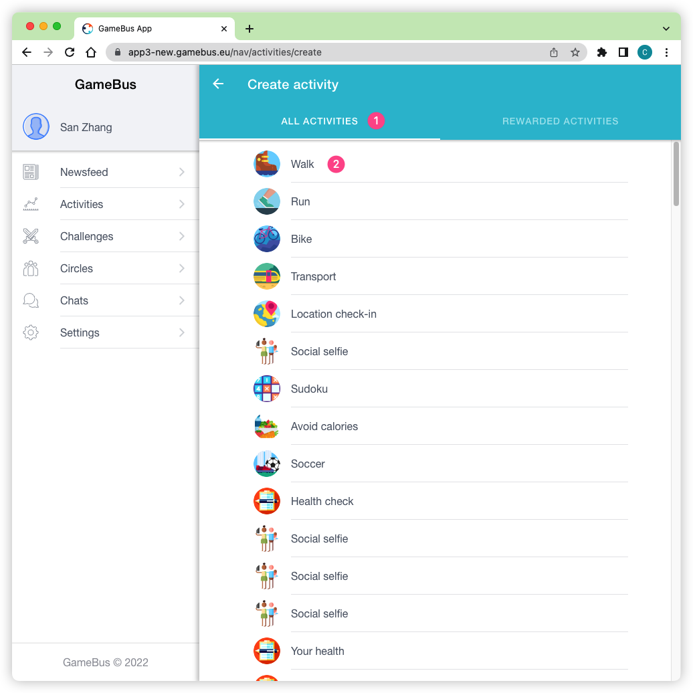
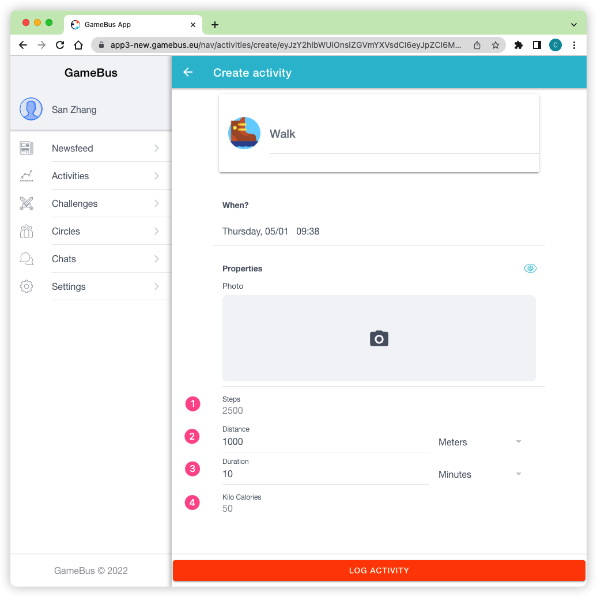
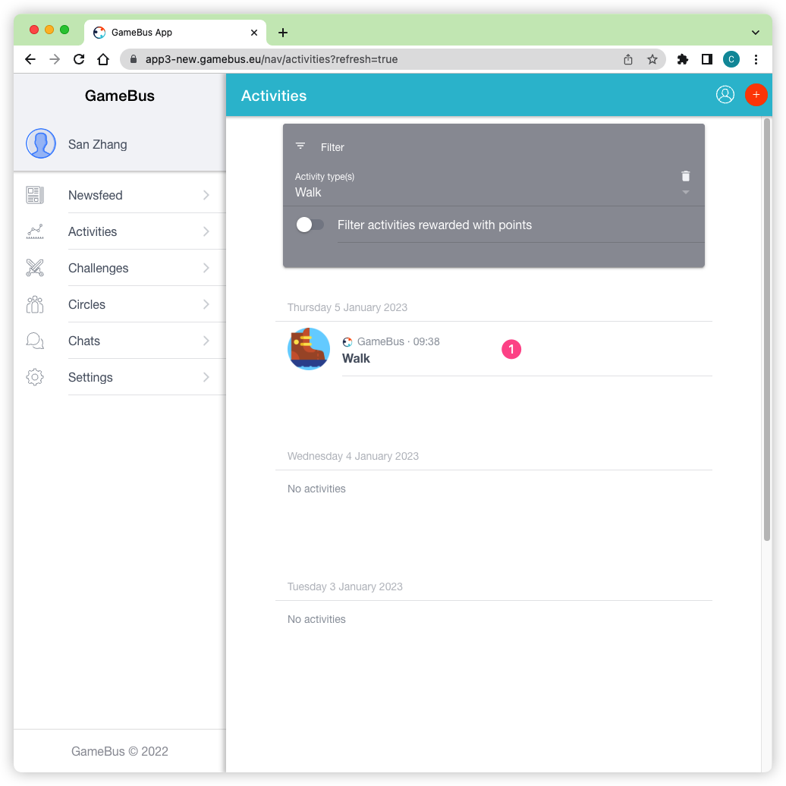
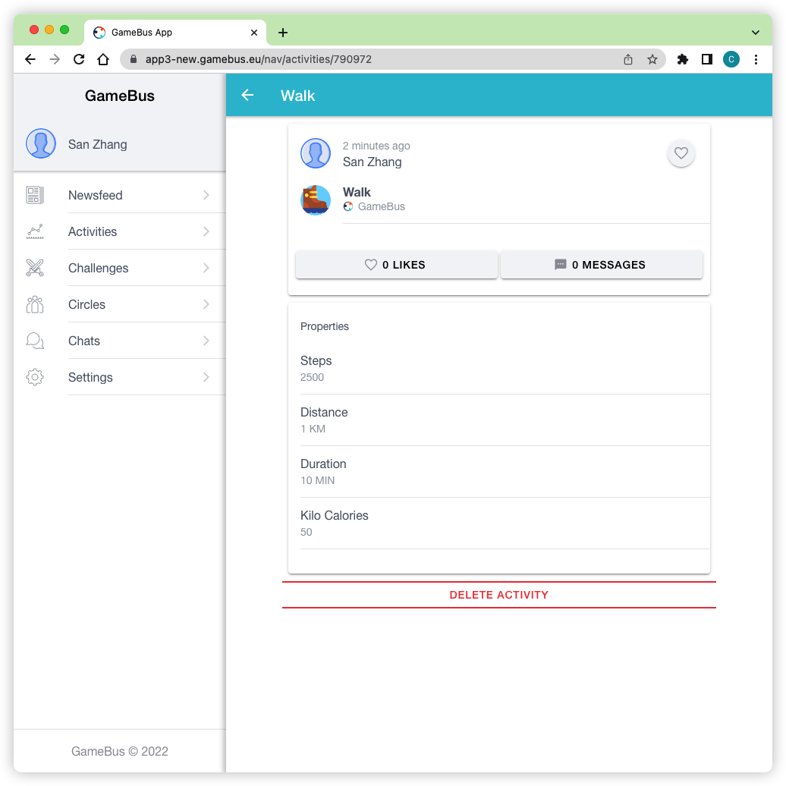
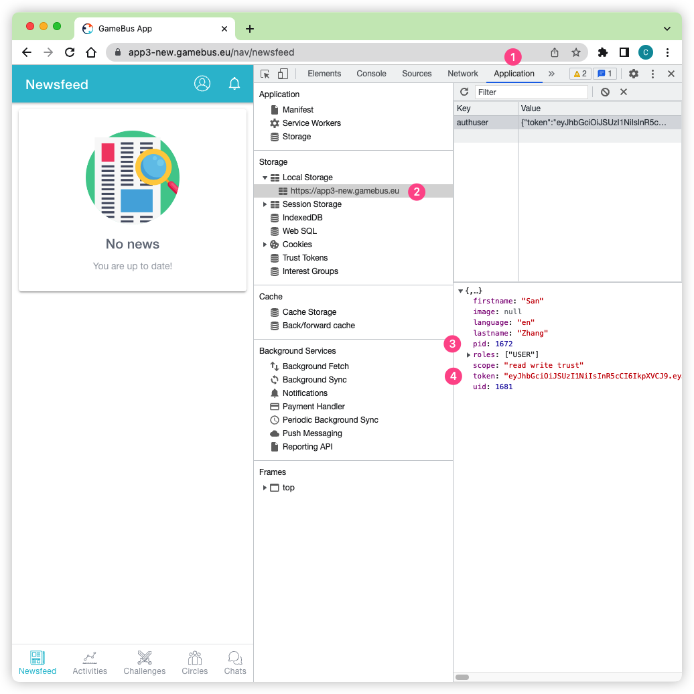

GameBus
=======

GameBus FHIR layer is a wrapper on top of GameBus platform, acting like a
translator. The layer itself does not have database, so not storing any data.
GameBus platform is where the data stored.

To use the FHIR layer, users need to create an account on GameBus platform
(for free) and then add some data to it for requesting later with FHIR REST API.

Create a GameBus account
------------------------

You can create a GameBus account in https://app3-new.gamebus.eu. Then you will
see a web app like screenshot below.

👉 If you want to explore full functionality of GameBus, you could check its manual
on https://blog.gamebus.eu. Note that it's NOT required for this tutorial.

Add data mannualy
-----------------

There are various ways to add activity data to GameBus. Here we'll manually
fill some data using its web app.

1. Click sidebar :guilabel:`Activities` and then click the plus button

2. Click :guilabel:`ALL ACTIVITIES` and then choose :guilabel:`Walk` activity

3. Add walk data manually. For example, here we add 2500 steps, 1000 meters,
   10 minutes and 50 Kcal. After filling the data, click :menuselection:`LOG ACTIVITY` to
   complete the filling.

4. Now you can see the walk activity in the :guilabel:`Activities` page, and
   click it to view details.

Get activity id
"""""""""""""""

We can get the id of the walk activity from url, the id here is :code:`790972`.
Check your url for the id, and it will be used in next section when sending
request to FHIR server.

Add more data
-------------

Likewise, you can add more data for other activites, e.g. run, bike,
BP measurement.

Also, remember to take a note of the id of each activity, you'll need them in
next section.

Get GameBus token and player id
-------------------------------

Chrome browser is required in this part since Chrome DevTools will be used.

1. Login GameBus web app (https://app3-new.gamebus.eu) using Chrome
2. Open Chrome DevTools by pressing key :kbd:`F12`.
   See `the guide <https://developer.chrome.com/docs/devtools/open/>`_ on how to
   open Chrome DevTools in different ways.
3. Click the :code:`Application` panel and then the :code:`Local Storage`, you
   will see player id :code:`pid` and token :code:`token` on the right region.
   The palyer id is the id for your GameBus account.
4. Take a note of the player id and token, they will be used in next section.

