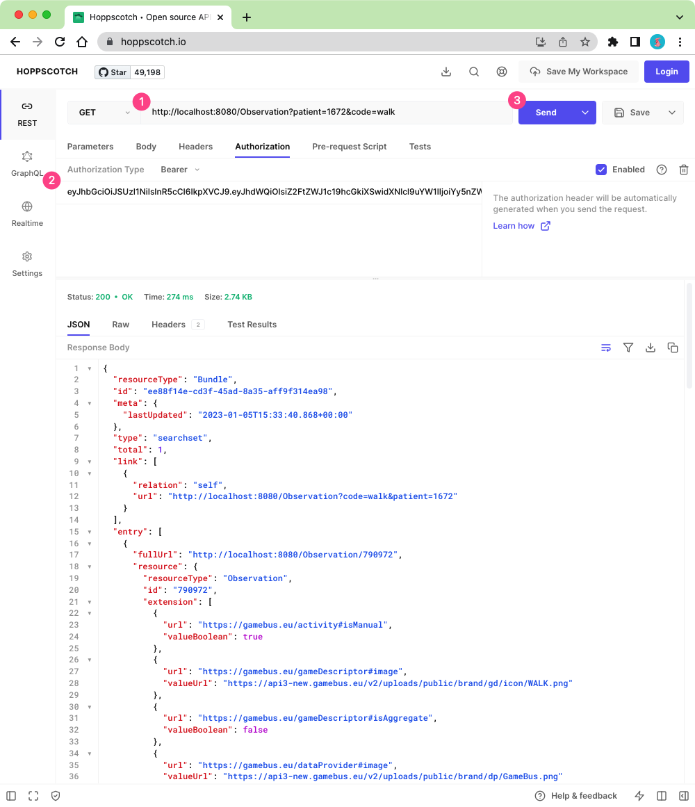

Request on FHIR API
===================

After :ref:`starting FHIR server<tutorial2_docker_run:start fhir server>` and
:ref:`adding data to GameBus platform<tutorial3_gamebus:add data manually>` in
previous sections, now it's ready to try the service of GameBus FHIR layer.

The FHIR layer is a service layer on top of the GameBus platform, providing the FHIR REST API
for communicating FHIR-compliant data with the outside. For example, when a user sends
an HTTP GET request to FHIR REST API, the FHIR layer will transform this request and
forward the transformed request to GameBus's API; GameBus will process the request,
e.g. read the requested data from its database, and then return the relevant data in
GameBus format to the FHIR layer; the FHIR layer will then transform the GameBus data to
data in FHIR-compliant format, and then return the FHIR data to user as a HTTP
response. That is how the FHIR layer works and how it enables GameBus to provide FHIR
service.

To try and test the FHIR API, we need API clients to help send HTTP requests.
Various API clients exist, e.g. `httpie`_, `Postman`_ and `Hoppscotch`_.

In this tutorial, we will use Hoppscotch. It's a web-based API client.
Open its website(https://hoppscotch.io/) in a browser, then you can start
sending HTTP requests.

Check the capability of FHIR server
-----------------------------------

We can check the capability of the FHIR server by sending a request to
:code:`[base]/metadata` API. We started the server of FHIR layer locally, so
:code:`[base]` here is :code:`localhost:8080`.

Open Hoppscotch website (https://hoppscotch.io/), check the screenshot below,
and do the following steps:

1. Use HTTP method :code:`GET`
2. Fill URL box with :code:`http://localhost:8080/metadata`
3. Click button :code:`Send`
4. You should see the response of FHIR server.

The response is FHIR `CapabilityStatement`_ resource, which describes the
available FHIR resources, operations, and functionalities on this FHIR server.

Check the resource body to see what FHIR resources and interactions are
supported by the current FHIR layer.

Read FHIR resources
-------------------

This part will show how to read FHIR `Patient`_ and `Observation`_ resources.
GameBus token, player id, and activity id will be required to send HTTP requests,
check :ref:`GameBus section <tutorial3_gamebus:Get activity id>` to
get them.

Read FHIR Patient resource
^^^^^^^^^^^^^^^^^^^^^^^^^^

FHIR `Patient`_ resource describes the profile of the patient. FHIR layer maps
the user or player profile of GameBus to the FHIR Patient data.

Check the screenshot below and follow the steps:

1. Fill URL box with :code:`http://localhost:8080/Patient/[pid]`. You need to
   replace :code:`[pid]` with your player id.
2. Click `Authorization` button
3. Select authorization type :code:`Bearer`
4. Fill in the token box with your GameBus token
5. Send the request

The response is a FHIR `Patient`_ resource, which is transformed from the
player data of GameBus by the FHIR server.

Check the detail of the response body to see if the information is consistent with
what you provided to GameBus when creating an account, e.g. first name, last
name and email.

Read FHIR Observation resource
^^^^^^^^^^^^^^^^^^^^^^^^^^^^^^

Some activity data (e.g. walk) were added to GameBus in the previous section. These
activities will be mapped to FHIR `Observation`_ resource by the FHIR layer.

To request the FHIR Observation data, the activity id is required, e.g. the id
of walk activity. Check :ref:`previous section<tutorial3_gamebus:Get activity id>`
to get it.

Check the screenshot below and follow the steps:

1. Fill URL box with :code:`http://localhost:8080/Observation/[activity_id]`.
   You need to replace :code:`[activity id]` with GameBus activity id, e.g.
   walk activity id is :code:`790972`.
2. Fill in Bearer token if it's empty
3. Send the request

The response is a FHIR `Observation`_ resource. Check the detail of the response body
to see if the information is consistent with the activity data you added to GameBus.

Search FHIR Observation resources
---------------------------------

Besides requesting FHIR observations with a specific id, FHIR layer also supports
searching based on e.g. observation type and/or date. To get the full list of
supported search parameters, you can check the :code:`CapabilityStatement` data
in the :ref:`section above<tutorial4_fhir_api:check the capability of fhir server>`.

Search specific types of observations
^^^^^^^^^^^^^^^^^^^^^^^^^^^^^^^^^^^^^

As an example, here we'd like to search all observations related to walk activity.

Check the screenshot below and follow the steps:

1. Fill URL box with :code:`http://localhost:8080/Observation?patient=[pid]&code=walk`.
   You need to replace :code:`[pid]` with GameBus player id.
2. Fill in Bearer token if it's empty
3. Send the request

The response is FHIR `Bundle`_ resource, it's a bundle of requested walk
activities (FHIR Observation data) with full URL to each observation.

Try other search parameters
^^^^^^^^^^^^^^^^^^^^^^^^^^^

Observation supports other search parameters besides :code:`code`.

Here are some examples you could try:

.. list-table::
   :widths: 60 20
   :header-rows: 1

   * - Request URL
     - Comment
   * - http://localhost:8080/Observation?patient=[pid]&code=walk,run,bike
     - search all observations related to walk, run and bike activities
   * - http://localhost:8080/Observation?patient=[pid]&date=gt2022-12-01
     - search all observations created after 1st December, 2022
   * - http://localhost:8080/Observation?patient=[pid]&code=walk&date=gt2022-12-01
     - search all *walk* observations created after 1st December, 2022
   * - http://localhost:8080/Observation?patient=[pid]&code=walk&_format=json
     - search all walk observations and set response format to json
   * - http://localhost:8080/Observation?patient=[pid]&code=walk&_sort=date
     - search all walk observations that are sorted by date
   * - http://localhost:8080/Observation?patient=[pid]&code=walk&_elements=code,subject.reference
     - search all walk observations and return only "code" and "subject.reference" parts of the Observation resource

⚠️ Note that the search parameter :code:`patient` is always required to specify
which patient (GameBus player) to query. When changing the patient (i.e. player id),
you also need to change the token to the one associated with that patient (GameBus player).

Useful links
------------

👉 Here is a `cheat sheet`_ for FHIR REST APIs.

👉 For a detailed explanation of all FHIR APIs and search parameters, please check `FHIR specification`_.

.. _httpie: https://httpie.io/
.. _Postman: https://www.postman.com/
.. _Hoppscotch: https://hoppscotch.io/
.. _CapabilityStatement: https://www.hl7.org/fhir/capabilitystatement.html
.. _Patient: https://www.hl7.org/fhir/patient.html
.. _Observation: https://www.hl7.org/fhir/observation.html
.. _Bundle: https://www.hl7.org/fhir/bundle.html
.. _cheat sheet: https://confluence.hl7.org/display/FHIR/FHIR+Cheatsheets
.. _FHIR specification: http://hl7.org/fhir/http.html#3.1.0
.. _curl: https://curl.se/
